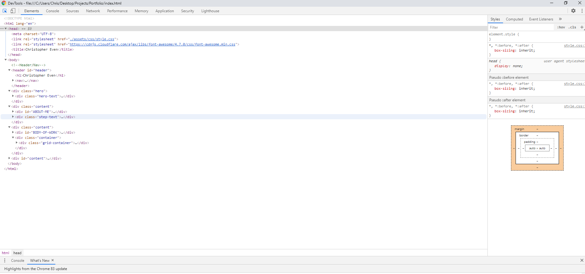

# Portfolio Project

I took some visual liberities, but its all here.

link text]https://ceven8498.github.io/portfolio/

https://ceven8498.github.io/Portfolio/

# Citation for Placeholder
https://blog.hyperiondev.com/index.php/2018/09/10/everything-need-know-mern-stack/ MERN place holder
https://www.matrixvisual.com/benefits-led-walls-versus-projection-displays/ LED Wall Place holder
https://lh3.googleusercontent.com/proxy/iMthxmRIN6JoRnIAZoTvsxpkGvhpuEzX7aGg6NhoBiE1ZpHzgdKsoDY6xv_ICo4vfMCDhu3jpUfqbWkAIuCc8DezgfJYqNeQH3vR pastel puz
https://www.burning-glass.com/blog/five-careers-where-coding-skills-will-help-you-get-ahead/ Calculator
